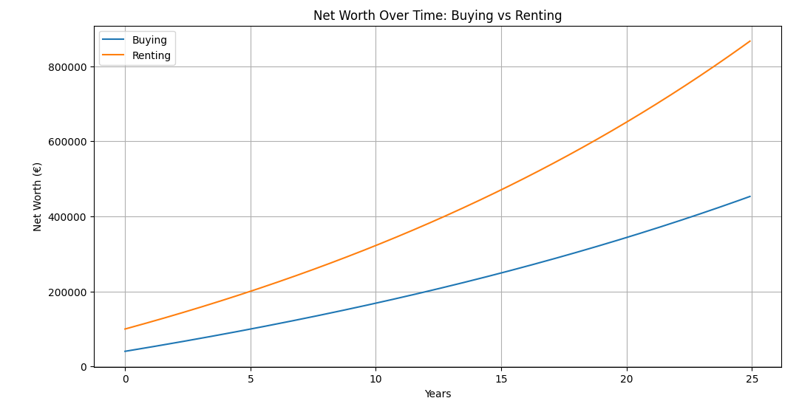

# Real Estate Buying vs Renting Model Dashboard

This Dash application provides a financial comparison between buying a property and renting, considering many factors.

## Features

- **Interactive Parameters**:  
  Users can adjust both external parameters (e.g., loan interest rate, property appreciation rate, rent inflation rate, investment return rate) and internal/personal parameters (e.g., purchase price, down payment, refurbish cost, nebenkost rate, maintenance rate, property taxes, and initial rent).

- **Monthly Payment and Loan Term**
  Users can first define and understand monthly payments or loan terms for buying scenario.
    - **Given Monthly Payment, find Loan Term**
    - **Given Loan Term, find Monthly Payment**

- **Model Comparisons**:  
  It compares buying versus renting net worth accumulation over time.



## Running the App
```
 MSYS_NO_PATHCONV=1 docker run -it fulaibaowang/immobilien:1.0.0 python /Immobilien/app.py
```